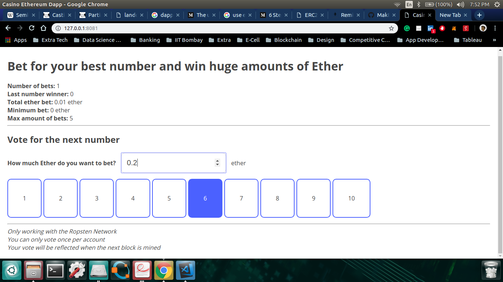

# Simple Casino DApp on Ethereum

This is a simple Casino DApp built which looks like this:

The Smart Contract is written using Solidity (Compiler Version: 5.0.0) and deployed on the Ropsten Testnet.

## To play the game, follow the following steps

1. Clone the repository using `git clone https://github.com/tezansahu/casino-ethereum.git` and go into it

2. Use `npm install` to install all the dependancies required for this DApp (as mentioned in the `package.json` file)

3. Use `npm install -g http-server` to install a lightwight server

4. To start the server, type `http-server ./dist`

5. Go to the mentioned address to play the game!!!